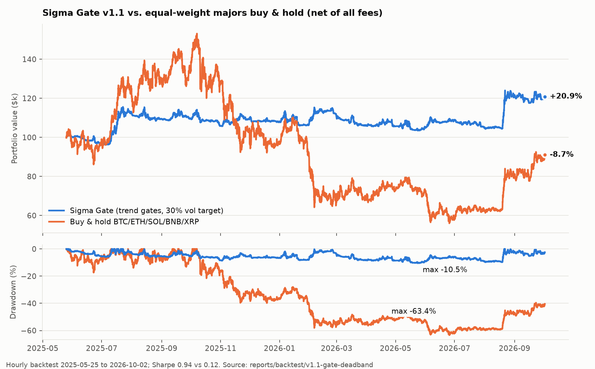
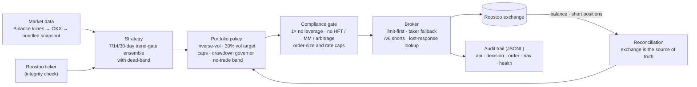
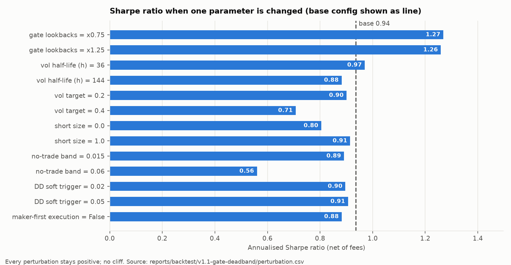

# Sigma Gate: Crypto Trend Allocation

[](https://github.com/DhmalTPS/Sigma-Gate-Crypto-Trend-Allocation/actions/workflows/tests.yml)
[](LICENSE)


*Volatility-targeted trend-gate allocation across crypto majors, with fee-aware execution
and drawdown-governed risk.*

**Team105 · Threshold Crushers (IIT Mandi)**: an autonomous trading bot for the
**HK vs AU vs IN Quant Trading Hackathon 2026** (Roostoo mock exchange · Susquehanna · AWS).
It runs unattended on AWS EC2, trades only through the Roostoo REST API, and logs every
decision, order and fill.

> **The idea in one paragraph.** With 0.10 % taker / 0.05 % maker fees and only 14 days of
> trading, the main way to lose is *overtrading*. We measured that the strongest short-horizon
> signal in crypto (cross-sectional reversal, t ≈ 17) loses money net of fees in **all 64**
> configurations we tried. So we trade **slowly**: a volatility-targeted book of the five
> largest crypto assets, where each coin's direction comes from an ensemble of 7/14/30-day
> trend gates with a dead-band. Shorts are half size, a drawdown governor caps losses, and
> execution tries passive limit orders first. Every design choice is backed by a statistical
> test in [`docs/RESEARCH_LOG.md`](docs/RESEARCH_LOG.md), including the rejected ideas.



## Contents

1. [Results at a glance](#1-results-at-a-glance)
2. [Architecture](#2-architecture)
3. [Competition constraints](#3-competition-constraints)
4. [How we arrived at the strategy](#4-how-we-arrived-at-the-strategy-research-summary)
5. [Strategy](#5-strategy)
6. [Trading engine](#6-trading-engine)
7. [Fees and risk management](#7-fees-and-risk-management)
8. [Backtest and robustness](#8-backtest-and-robustness)
9. [Live operations](#9-live-operations-during-the-contest)
10. [Quick start](#10-quick-start)
11. [Repository map](#11-repository-map)
12. [Limitations](#12-limitations-honest)

---

## 1. Results at a glance

| | **Sigma Gate v1.1** | Buy & hold same 5 coins |
|---|---|---|
| Backtest return (≈16 months, net of fees) | **+20.9 %** | −8.7 % |
| Sharpe / Sortino | **0.94 / 1.33** | 0.12 / 0.17 |
| Max drawdown | **10.5 %** | 63.4 % |
| Worst drawdown in any 14-day window | **6.1 %** | — |
| Robustness | all 13 single-parameter perturbations Sharpe > 0.5 | — |

**Live contest evidence (as of 2026-10-06, from the bot's logs and the exchange):**

| | |
|---|---|
| Uptime | continuous since contest open, 0 crashes |
| Fills | 100 % passive limit orders (maker fee 0.05 %), fees ≈ 0.035 % of NAV |
| API | 4,200+ calls, 0 real errors, peak 15 requests/min (no-HFT) |
| Compliance blocks / manual trades | 0 / 0 |
| Max drawdown | 1.6 % |

The full live NAV curve is added here at the end of the contest (`scripts/export_live.py` →
`reports/live/` → `scripts/make_charts.py`).

## 2. Architecture



The **same** `strategy.compute()` → `policy.target_weights()` code runs in the backtester and in
the live bot; only the data source and the execution adapter differ.

## 3. Competition constraints

Hard-coded in [`config/competition.yaml`](config/competition.yaml) and enforced in code:

| Rule | How the bot enforces it |
|---|---|
| $100,000 mock portfolio | NAV read from the exchange every cycle, never assumed |
| Spot only, 1× long **and** short, no leverage | `max_gross 0.95`; the compliance gate rejects any order with post-trade gross > 1×; shorts use Roostoo's collateralised `/v6` endpoints (collateral ≤ free cash) |
| Taker 0.10 %, maker 0.05 % | Charged in the backtester; execution tries maker first. Verified on the exchange: real fills charge exactly these rates |
| No HFT | Hourly decisions; ≤ 20 orders/cycle, ≤ 40/hour; client-side rate limiter (30 req/min) |
| No market making | One side per pair at a time; every order moves the position *toward* the target; the gate blocks opposite resting orders |
| No arbitrage | One venue, directional positions only |
| Autonomous, no manual API calls | All orders come from `live/runner.py`; `smoke_test.py` refuses the competition keys; fills carry `OrderSource: PUBLIC_API` |
| ≥ 8 active trading days with enough trades | Activity guard: from 12:00 UTC, if the day has < 2 fills, the bot makes a small (0.5–2 % NAV) trade toward its *unbanded* target, retrying hourly |
| Open source, traceable commits | [MIT license](LICENSE); every change goes through [`docs/CHANGE_CONTROL.md`](docs/CHANGE_CONTROL.md) and [`CHANGELOG.md`](CHANGELOG.md); the config `version` is stamped on every log line |

The generic Roostoo API docs show $50k and 0.012 % / 0.008 % fees as examples; we use the
competition values above.

## 4. How we arrived at the strategy (research summary)

All research is reproducible (`research/*.py`) on 540 days of hourly data for all 88 Roostoo
pairs (Roostoo mirrors Binance spot; BTC matches to about 1 bp). Full write-up:
[`docs/RESEARCH_LOG.md`](docs/RESEARCH_LOG.md).

1. **Signal term structure (R1).** Rank ICs with non-overlapping t-stats: reversal is strong at
   1–12 h; trend pays only at ≥ 1 week; residual momentum is noise; timing total exposure with
   the market trend has a *negative* relationship.
2. **Fees kill fast signals (R2).** Reversal earns about +49 %/yr gross at 1 h but costs about
   456 %/yr in maker fees. Rejected, in all 64 configurations.
3. **Concentrate in the largest coins; target volatility (R3).** Altcoins bled against BTC
   (median coin −57 % vs BTC −19 %). Vol targeting halved tail drawdowns.
4. **Per-coin trend-gate ensemble (R4).** Single lookbacks are fragile (Sharpe from −0.6 to 1.0
   by lookback). The 7/14/30-day ensemble is smooth under ±25 % perturbation (0.59 / 0.68 /
   0.80), so we use the centred ensemble rather than the best-looking row.
5. **Half-size shorts (R5)** cut max drawdown from 21 % to 16 % and raised Sharpe.
6. **Gate dead-band (R6).** In the full hourly engine, plain sign gates flipped whenever a trend
   sat near zero (110× NAV turnover, Sharpe 0.10). A ±0.5σ dead-band fixes this (Sharpe 0.94).

**Universe choice.** The five coins (BTC, ETH, SOL, BNB, XRP) were fixed in advance as the
largest non-stablecoin crypto assets by market cap, not picked from backtests. Checked
afterwards: they beat a "top-5 by trading volume, re-picked daily" rule (Sharpe 0.61 vs 0.15)
and match a top-8-by-volume rule (0.67).

## 5. Strategy

For each coin *i* in {BTC, ETH, SOL, BNB, XRP} and each lookback *L* ∈ {168, 336, 720} h:

```
z_iL = log(P_t / P_{t-L}) / (σ_i,1h · √L)              vol-normalised trend
g_iL = +1 if z > +0.5, −1 if z < −0.5, else previous g  (dead-band)
s_i  = mean_L g_iL  ∈ {−1, −⅓, +⅓, +1}
```

**Portfolio construction** (`portfolio/policy.py`, `sizing: absolute`):

```
base_i = (1/σ_i) / Σ_j (1/σ_j)                       inverse-vol basket
scale  = min(1, 30% / σ_basket)                      σ from a shrunk covariance matrix
w_i    = s_i · base_i · scale · (½ if s_i < 0)       half-size shorts
w_i    = clip(w_i, ±40% BTC/ETH, ±30% others);  Σ|w| ≤ 95%
w      = w · DD_multiplier                           1 → 0.25 as drawdown goes 3% → 10%
                                                     (rolling 14-day peak)
```

The book is fully invested at the target volatility only when every gate is on. As trends
break, exposure **falls**; it is never re-normalised back to 100 %. Covariance (not the sum of
single-coin risks) sets the scale, because crypto correlations are high. A no-trade band
(|Δw| > 3 % NAV or > 20 % of the target) stops the bot paying fees to chase small drift.

## 6. Trading engine

```
every hour (+90 s, after the bar closes)
  1. cancel our resting limits from the last hour (and remember which went unfilled)
  2. update bars: Binance klines → OKX → bars built from Roostoo snapshots
  3. read the TRUE book from the exchange: /v3/balance + /v6/short_positions
  4. strategy.compute()            same code as the backtest
  5. policy.target_weights()
  6. execute: risk-reducing legs first; long legs as passive LIMIT at the touch;
     after 1 unfilled hour → MARKET; short legs via /v6 (always 0.10 %)
  7. activity guard, shadow portfolios, decision log, atomic state save
every 60 s : ticker (one request for all pairs)
every 5 min: NAV snapshot + intra-hour circuit breaker
```

**Failure handling** (`api/client.py`, `execution/broker.py`):

* **Lost response after an order:** never re-sent. The bot looks the order up with
  `query_order` first, which prevents double fills.
* **Restart / crash:** systemd restarts the bot within 20 s. Positions are rebuilt from the
  exchange, so the bot never "forgets" a position (verified live: after restarts it placed 0
  duplicate orders).
* **Clock drift:** server-time offset re-synced every 10 min; chrony runs on EC2.
* **Stale data:** a pair is excluded if its bar close differs from Roostoo's live price by
  more than 2 %; no trading at all on data older than 3 h.
* **Roostoo quirks handled:** errors come back as HTTP 200 with `Success:false`; "no order
  matched" means empty, not failure; `offset=0` is rejected by `query_order`; an account-wide
  "no permission to trade" (before the contest opened) must not disable shorts.

## 7. Fees and risk management

* **Fees:** maker first (5 bps), taker only after one hour of patience or when reducing risk
  urgently. The backtester counts a maker fill **only if the next bar trades through the limit
  by 2 bps**, which builds in adverse selection. Unfilled orders pay taker plus the spread
  implied by the price tick.
* **Universe hygiene:** pairs whose one-tick spread exceeds 5 bps are excluded (e.g. PEPE's
  tick alone is about 22 bps).
* **Risk layers:** vol target → per-coin caps → gross ≤ 95 % → drawdown governor → 25 % NAV
  per-order cap (large orders are split across cycles) → **circuit breaker** (15 % drawdown: go
  flat for 12 h) → API-failure and stale-data pauses.
* **Why drawdown gets extra weight:** the finalist score includes 0.4 Sortino + 0.3 Sharpe +
  0.3 Calmar. Over a 14-day window an annualised Calmar can be far larger than the other two,
  so max drawdown is the most leveraged quantity in the score.

## 8. Backtest and robustness

Period 2025‑05‑25 → 2026‑10‑02 (≈ 16 months, hourly decisions, $100k start, all fees):

| Metric | **Sigma Gate v1.1** | EW majors buy & hold |
|---|---|---|
| Total return | **+20.9 %** | −8.7 % |
| Annualised vol | 16.4 % | ≈ 55 % |
| Sharpe / Sortino | **0.94 / 1.33** | 0.12 / 0.17 |
| Max drawdown | **10.5 %** | 63.4 % |
| Calmar (raw) | 1.99 | −0.14 |
| Probabilistic Sharpe (P[SR > 0]) | 0.86 | — |
| Bootstrap P(Sharpe > 0), 90 % CI | 0.85, [−0.48, 2.38] | — |
| Fees paid · turnover | $3,133 · 41× NAV | — |

**Contest-length view.** Every 14‑day window in the backtest (481 windows): 10th / 50th / 90th
percentile return **−2.6 % / −0.3 % / +4.4 %**; 90th‑percentile drawdown **4.9 %**, worst
6.1 %. Outcomes are positively skewed: small losses, larger wins.



Every perturbation stays positive with no cliff. The chosen values are **not** the in-sample
best (lookbacks ×0.75 would score higher); we keep the centred, pre-registered values. These
numbers come from the same `compute` → `target_weights` path that runs live, with conservative
fills; full outputs are in [`reports/backtest/`](reports/backtest/).

## 9. Live operations during the contest

* **One-command status report** (`scripts/report.py`, read-only): service health, return,
  drawdown, Sharpe/Sortino/Calmar, holdings vs targets, each coin's trend gates and the price
  at which they would flip, every order and fill with fees and maker share, active trading
  days, API health, shadow books and compliance blocks.
* **Shadow portfolios** (no-shorts, 20 % and 40 % vol target) run on the same signals as the
  real book, giving counterfactual evidence before any change. They reset at each restart.
* **Change control:** five tiers, from infra fixes (always allowed) to strategy replacement
  (needs very strong evidence); never retune because of one bad day. Every live change is in
  [`CHANGELOG.md`](CHANGELOG.md).
* Logs: `logs/deployment/<UTC day>/{api,decision,order,nav,health,compliance}.jsonl`.

## 10. Quick start

```bash
pip install -r requirements.txt
python -m pytest -q                                   # 19 unit tests, no network needed
python scripts/download_data.py --days 540            # Binance hourly history (cached)
python scripts/run_backtest.py                        # production config, full engine
```

Run the bot (keys are read from env vars or git-ignored files, never committed):

```bash
python scripts/smoke_test.py                           # read-only connectivity, testing account
python scripts/run_bot.py --profile testing --dry-run --once
```

Deploy on the organizer-provided EC2 (Sydney, t3.medium, Session Manager):
[`docs/DEPLOYMENT.md`](docs/DEPLOYMENT.md).

## 11. Repository map

```
config/             competition.yaml (rules) · strategy.yaml (versioned parameters)
src/t105/api/       signed client, credentials (env/files, never logged), exchange metadata
src/t105/data/      history download (Binance → OKX → snapshot), universe
src/t105/strategy/  signals, regime features, ensemble core
src/t105/portfolio/ path-dependent policy (hysteresis, sizing, vol target, DD governor, bands)
src/t105/backtest/  execution-aware backtester
src/t105/execution/ broker: exchange-truth book, orders, ambiguous-response resolution
src/t105/risk/      compliance gate + limits
src/t105/live/      market data + autonomous runner (activity guard, shadows)
research/           every experiment behind the design (R1–R6)
reports/            backtest outputs per version (nav, trades, windows, perturbation)
scripts/            run_bot · report · smoke_test · run_backtest · download_data
                    export_live · make_charts
deployment/         install.sh · systemd unit · .env.example · healthcheck.sh
docs/               RESEARCH_LOG · DEPLOYMENT · CHANGE_CONTROL · img/
tests/              signing vs Roostoo doc vector, causality (no look-ahead), policy invariants,
                    execution planner, shorts handling, activity guard, compliance
```

## 12. Limitations (honest)

* About 16 months is roughly one market cycle; the edge is suggestive (PSR 0.86), not proven.
  Trend following loses in choppy markets (our middle third lost money); drawdown control is
  what bounds that.
* A negative contest return gives negative ratios regardless of how small the drawdown is;
  low volatility only helps when the return is positive.
* We assume Roostoo's limit fills behave like "trade-through" fills; the live maker share
  (100 % so far) is monitored in the logs.
* External data dependency (Binance klines) has OKX and Roostoo-snapshot fallbacks.

## License

[MIT](LICENSE) © 2026 DhmalTPS
